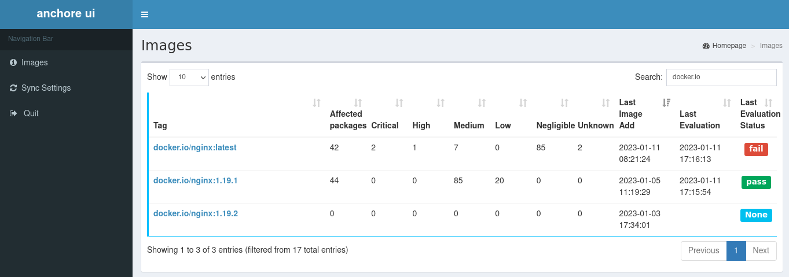
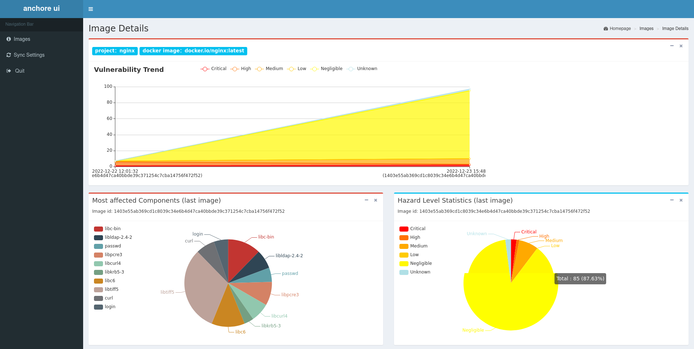

# Anchore_ui




## Presentation

**Anchore_ui** This is a web-based system for presenting the results of Anchore engine scans. It also improves Anchore's scan results, for example, for java language patches, Anchore does not provide a patched version of the vulnerability, this system fixes this problem.

## Supported Platforms

* Linux
* Windows

## Features

* Integrate anchor analysis results and evaluation by tag
* Display trend over time for a given tag
* Display statistics (severity, packages) for a given tag
* Export vulnerabilities to excel files

## Install guide

[](https://www.python.org/) 
[](https://www.mongodb.com/download-center?jmp=nav)

### Source Code Deployment

**Dependencies**: the project runs on mongodb, so you need to prepare mongodb

***

**Source Deployment**

The steps are as follows.


#### 1. Add mongodb authentication

**Create new db user on mongodb server**, here a new user with username `anchore_ui` and password `123456` is created.

```
# mongo
> use admin
> db.createUser({user:'anchore_ui',pwd:'123456', roles :[{role:'readWriteAnyDatabase', db:'admin'}]})
> exit
```

#### 2. Install python dependencies

```
# git clone https://github.com/gmoirod/anchore_ui.git
# cd anchore_ui
# pip install -r requirements.txt
```

#### 3.Modify the configuration file

First make a copy of `config.py.sample` and rename it to `config.py`.
```
# cp anchore_ui/config.py.sample anchore_ui/config.py
```

Next, change the configuration information in config.py:

```
# Track actual configuration related to mongodb
MONGO_IP = '192.168.47.1'
MONGO_PORT = 27017
MONGO_USER = 'anchore_ui'
MONGO_PWD = '123456'
# Modify anchore configuration according to actual situation
ANCHORE_API = "http://192.168.1.1:8228"
ANCHORE_USERNAME = " admin
MOT DE PASSE = "foobar"
```

#### 4. Startup

In the program directory, run the following command
```
# python run.py
```

### Containerized deployment

#### 1. Compose your containers

Copy [docker-compose.yml.sample](docker-compose.yml.sample) to a docker-compose.yml and customize it with your Anchore context.

```yaml
...
    environment:
      MONGO_IP: 'mongo'
      MONGO_PORT: 27017
      MONGO_USER: 'anchore_ui'
      MONGO_PWD: '123456'
      UI_USERNAME: 'user'
      UI_PASSWORD: 'user'
      # Please modify the following configuration with your Anchore settings
      ANCHORE_API: 'http://anchore-engine-api.nip.io'
      ANCHORE_USERNAME: 'admin'
      ANCHORE_PASSWORD: 'anchore'
...
```

#### 2. Build and Start containers
```bash
$ docker-compose up --build -d
```
If a similar message is issued, then the boot is successful and you can access [http://ip:8888](http://ip:8888).

Enter username and password from docker-compose.yml to login.
```bash
...
scanner_1  | [2023-01-11 Wednesday 17:06] [INFO] Scheduler started
scanner_1  | [2023-01-11 Wednesday 17:06] [DEBUG] Looking for jobs to run
scanner_1  |  * Serving Flask app "apps" (lazy loading)
scanner_1  |  * Environment: production
scanner_1  |    WARNING: Do not use the development server in a production environment.
scanner_1  |    Use a production WSGI server instead.
scanner_1  |  * Debug mode: on
scanner_1  | [2023-01-11 Wednesday 17:06] [DEBUG] No jobs; waiting until a job is added
scanner_1  | [2023-01-11 Wednesday 17:06] [INFO]  * Running on http://0.0.0.0:8888/ (Press CTRL+C to quit)
```

## User Guide

### 1. Configuring Scheduled Tasks

Just set up a scheduled task to sync anchor scans at regular intervals.


