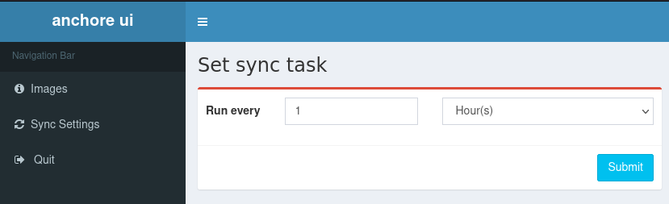

# Anchore_ui


## Presentation

**Anchore_ui** This is a web-based system for presenting the results of Anchore engine scans. It also improves Anchore's scan results, for example, for java language patches, Anchore does not provide a patched version of the vulnerability, this system fixes this problem.

## Supported Platforms

* Linux
* Windows

## Features

* Provide version numbers of jar package patches (only severe and high-risk vulnerabilities version numbers are provided).
* Export vulnerabilities to excel files
* Integrate anchor analysis results
* Show dependencies (only maven is supported at the moment)

## Install guide

[](https://www.python.org/) 
[](https://www.mongodb.com/download-center?jmp=nav)

### Source Code Deployment

**Dependencies**: the project runs on mongodb, so you need to prepare mongodb

***

**Source Deployment**

The steps are as follows.


#### 1. Add mongodb authentication

**Create new db user on mongodb server**, here a new user with username `anchore_ui` and password `123456` is created.

```
# mongo
> use admin
> db.createUser({user:'anchore_ui',pwd:'123456', roles :[{role:'readWriteAnyDatabase', db:'admin'}]})
> exit
```

#### 2. Install python dependencies

```
# git clone https://github.com/zj1244/anchore_ui.git
# cd anchore_ui
# pip install -r requirements.txt
```

#### 3.Modify the configuration file

First make a copy of `config.py.sample` and rename it to `config.py`.
```
# cp anchore_ui/config.py.sample anchore_ui/config.py
```

Next, change the configuration information in config.py:

```
# Track actual configuration related to mongodb
MONGO_IP = "192.168.47.1"
MONGO_PORT = 27017
MONGO_USER = "root
MONGO_PWD = "root
# Modify anchore configuration according to actual situation
ANCHORE_API = "http://192.168.1.1:8228"
ANCHORE_USERNAME = " admin
MOT DE PASSE = "foobar"
```

#### 4. Startup

In the program directory, run the following command
```
# python run.py
```

### Containerized deployment

#### 1. Build the image

```bash
$ docker build -t anchore_ui .
```

#### 2. Start your containers

```bash
$ docker run -d \
  -p 27017:27017 \
  -e MONGO_INITDB_ROOT_USERNAME="anchore_ui" \
  -e MONGO_INITDB_ROOT_PASSWORD=123456 \
  -v /etc/localtime:/etc/localtime:ro \
  -v /some/path:/data/db \
  --name mongo \
  mongo:latest

$ docker run -d \
  --network=host \
  -e MONGO_IP="localhost" \
  -e MONGO_PORT="27017" \
  -e MONGO_USER="anchore_ui" \
  -e MONGO_PWD="123456" \
  -e UI_USERNAME="user" \
  -e UI_PASSWORD="user" \
  -e ANCHORE_API="http://anchore-engine-api.nip.io" \
  -e ANCHORE_USERNAME="admin" \
  -e ANCHORE_PASSWORD="anchore" \
  -v /etc/localtime:/etc/localtime:ro \
  -v /etc/timezone:/etc/timezone:ro \
  --name anchore_ui \
  anchore_ui:latest
```

#### 2b. Compose your containers

Copy [docker-compose.yml.sample](docker-compose.yml.sample) to a docker-compose.yml and customize it with your Anchore context.

```yaml
...
    environment:
      MONGO_IP: mongo
      MONGO_PORT: 27017
      MONGO_USER: anchore_ui
      MONGO_PWD: 123456
      UI_USERNAME: user
      UI_PASSWORD: user
      # Please modify the following configuration with your Anchore settings
      ANCHORE_API: http://anchore-engine-api.nip.io
      ANCHORE_USERNAME: admin
      ANCHORE_PASSWORD: anchore
...
```

**Start container**
```bash
$ docker-compose up -d
```
If a similar message is issued, then the boot is successful and you can access [http://ip:8888](http://ip:8888).

Enter username and password from docker-compose.yml to login.
```bash
# docker logs $(docker ps | grep anchore_ui | awk '{print $1}')
[2020-07-16 Thursday 16:57] [INFO] Scheduler started
[2020-07-16 Thursday 16:57] [DEBUG] Looking for jobs to run
 * Serving Flask app "apps" (lazy loading)
 * Environment: production
   WARNING: Do not use the development server in a production environment.
   Use a production WSGI server instead.
 * Debug mode: on
[2020-07-16 Thursday 16:57] [INFO]  * Running on http://0.0.0.0:8888/ (Press CTRL+C to quit)
[2020-07-16 Thursday 16:57] [DEBUG] Next wakeup is due at 2020-07-16 17:04:54.782021+08:00 (in 461.596599 seconds)
```

## User Guide

### 1. Configuring Scheduled Tasks

Just set up a scheduled task to sync anchor scans at regular intervals.


